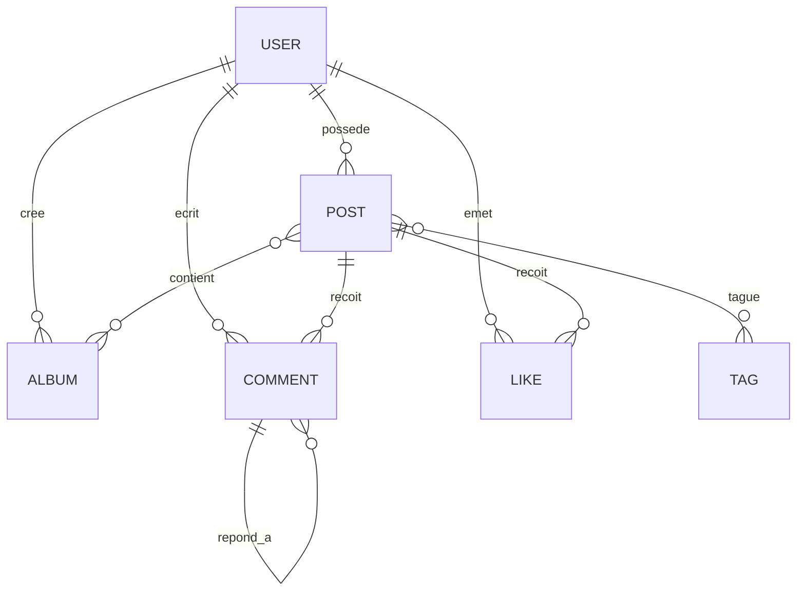

# PhotoSphere - Livrable 3 : Base de Données

## 📋 Description

Galerie photo communautaire permettant aux photographes de partager, organiser et interagir autour de leurs créations.

---

## 🗄️ Structure de la Base de Données

### Tables Principales

#### **Users**

- Gestion de 4 types d'utilisateurs : Basic, Pro, Moderator, Administrator
- Attributs spécifiques selon le rôle (quota uploads, abonnement, niveau modération)
- Authentification sécurisée avec hash bcrypt

#### **Posts**

- Photos uploadées avec métadonnées complètes
- 3 états : draft, published, archived
- Limites : 10 Mo max, formats acceptés (JPEG, PNG, GIF)
- Compteur de vues automatique

#### **Albums**

- Organisation des posts en collections
- Albums publics (tous) ou privés (Pro uniquement)
- Maximum 100 photos par album
- Photo de couverture configurable

#### **Tags**

- Système de catégorisation avec slug unique
- Normalisation automatique (minuscules, pas de doublons)
- Compteur d'utilisation

#### **Comments**

- Commentaires hiérarchiques (réponses possibles)
- Édition trackée avec timestamp
- Modération par propriétaire/modérateurs

#### **Likes**

- Un like unique par utilisateur/post
- Horodatage pour statistiques

### Tables de Liaison (N:M)

- **album_posts** : Association posts ↔ albums
- **post_tags** : Association posts ↔ tags

---

## 🔑 Règles Métier Clés

### Quotas & Permissions

- **BasicUser** : 10 uploads/mois, albums publics uniquement
- **ProUser** : Uploads illimités, albums privés, statistiques avancées
- **Moderator** : Suppression commentaires, désactivation comptes
- **Administrator** : Contrôle total, gestion système

### Contraintes d'Intégrité

- Cascade DELETE : Suppression utilisateur → suppression posts/albums/comments/likes
- Unicité : username, email, (user_id, post_id) pour likes
- Validation : Taille fichiers, formats MIME, longueurs textes

---

## 📊 Diagramme Entité-Relation

---

## 🚀 Installation

### Prérequis

- MySQL 8.0+
- PHP 8.0+

## 🔒 Sécurité

- Mots de passe hashés (bcrypt)
- Validation MIME réelle des fichiers
- Protection injection SQL (prepared statements)
- Contraintes au niveau base de données

---

## 📈 Performance

- Index sur colonnes fréquemment requêtées
- Compteurs dénormalisés (photo_count, usage_count, view_count)
- CASCADE optimisé pour suppression en masse

---

---

## 📅 Version

**Livrable 3** - Décembre 2024  
Base de données complète conforme au cahier des charges
